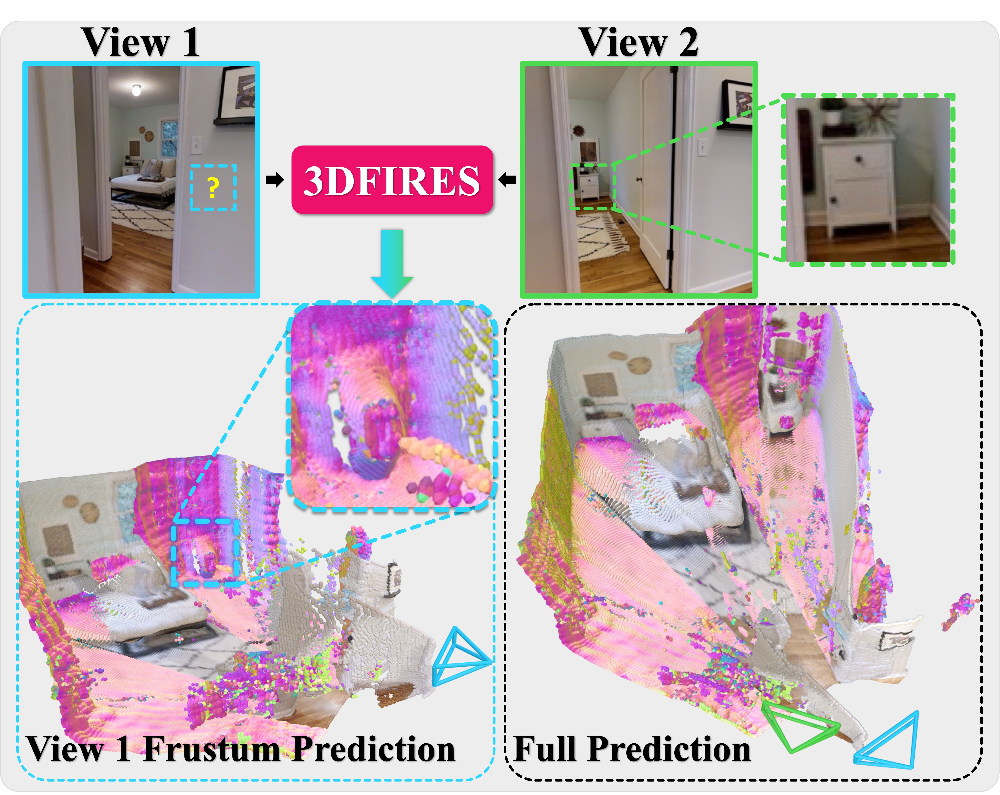

# 3DFIRES: Few Image 3D REconstruction for Scenes with Hidden Surfaces

<a href="https://jinlinyi.github.io/3DFIRES/"></a> 
<a href="https://arxiv.org/abs/2403.08768"></a>

[Linyi Jin<sup>1</sup>](https://jinlinyi.github.io/), 
[Nilesh Kulkarni<sup>1</sup>](https://nileshkulkarni.github.io/), 
[David F. Fouhey<sup>2</sup>](https://cs.nyu.edu/~fouhey/) \
<sup>1</sup>University of Michigan <sup>2</sup>New York University



<br />
<br />
<br />

3DFIRES reconstructs scene-level 3D from posed images, which works with as few as one view, reconstructs the complete geometry of unseen scenes, including hidden surfaces.

<br />
<br />
<br />
<br />

## Install
```sh
conda env create -f environment.yml
conda activate 3dfires
```

```bash
# Download Pretrained Model
cd ckpts
wget https://www.dropbox.com/scl/fi/n5en8p4rqyudrj4kg8f3g/model_0299999.pth?rlkey=mva5crd8smkegkzgl41zh89tv
cd ..
```

In dropbox, we provide preprocessed file for testing, download and save to `dataset/`
```bash
wget -O dataset.tar "https://www.dropbox.com/scl/fi/hv4zn8s09vjsy0en0au0v/dataset.tar?rlkey=4910bmzoflnhpymfp1m1inhtj&dl=1"
tar -xvf dataset.tar
```

To get the full dataset for evaluation and training, you need to download the [omnidata](https://github.com/EPFL-VILAB/omnidata/tree/main/omnidata_tools/dataset#downloading) Taskonomy Medium dataset as tar files (no need to decompress since our code directly read from tar). We also need to create tarindex for faster IO.
```bash
conda install -c conda-forge aria2
pip install 'omnidata-tools'

omnitools.download rgb depth_zbuffer \
   --components taskonomy \
   --subset medium \
   --dest ./dataset/omnidata \
   --name YOUR_NAME --email YOUR_EMAIL --agree_all \
   --only_download True \
   --keep_compressed True 
```

Create [tarindexer](https://github.com/devsnd/tarindexer) for fast tar IO.
```bash
git clone git@github.com:devsnd/tarindexer.git
cd tarindexer
ROOT=../dataset/omnidata
tar=$ROOT/compressed
tarindex=$ROOT/tarindex
mkdir -p $tar
mkdir -p $tarindex
ls $tar | xargs -I{} python tarindexer.py -i $tar/{} $tarindex/{}
```
<!-- ```bash
# ISSUE: ImportError: /lib64/libstdc++.so.6: version `GLIBCXX_3.4.29' not found
# reference https://stackoverflow.com/questions/48453497/anaconda-libstdc-so-6-version-glibcxx-3-4-20-not-found
conda install libgcc
export LD_LIBRARY_PATH=/nfs/turbo/fouheyUnrep/jinlinyi/miniforge3/envs/3dfires/lib:$LD_LIBRARY_PATH
``` -->
## Demo
```
bash demo.sh
```

## Evaluation
```bash
bash eval.sh
```

## Training
```bash
bash train.sh
```

## BibTeX

```
@article{jin20243dfires,
  author    = {Jin, Linyi and Kulkarni, Nilesh and Fouhey, David},
  title     = {3DFIRES: Few Image 3D REconstruction for Scenes with Hidden Surfaces},
  journal   = {CVPR},
  year      = {2024},
}
```
